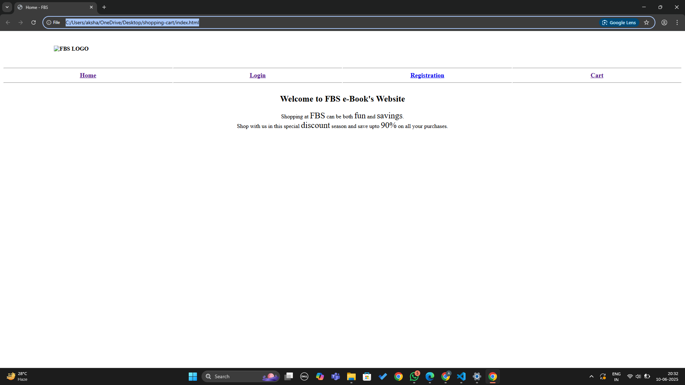

1. **Created a folder** named `shopping-cart` with all required HTML and CSS files.
2. Designed individual pages:
   - `index.html`: Welcome page with links to login and register.
   - `register.html`: Form for new user registration.
   - `login.html`: Simple login form.
   - `catalog.html`: Product listing with “Add to Cart” buttons.
   - `cart.html`: Shows selected items (static for now).
3. Used **CSS3**, with:
   - `display: flex;` for form layout.
   - `display: grid;` in catalog page for products.
   - Media-responsive features like `auto-fit`, `minmax()`, and flexible units.
4. Linked `style.css` to all HTML files for uniform styling.
5. Tested the app by opening `index.html` in a browser.
6. Resized browser window to **verify responsiveness** of layouts.

